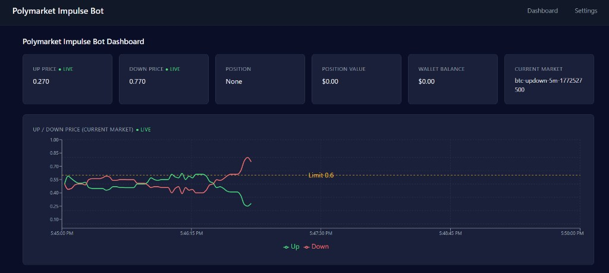
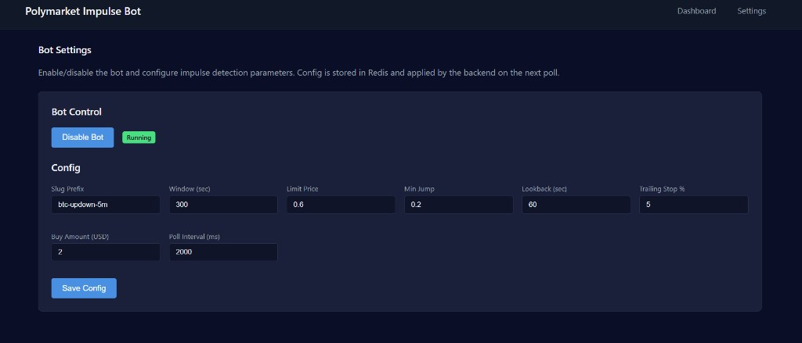

# Polymarket Impulse Bot

A trading bot that monitors Polymarket Up/Down binary markets, detects sudden price impulses, buys the rising side, trails price, and hedges when the price drops below a trailing stop.

## Main Strategy

The bot implements a momentum-based impulse trading strategy:

1. **Market Selection** – Watches Polymarket Up/Down markets matching a configurable slug prefix (e.g. `btc-updown-5m`). Each market has a fixed time window (e.g. 5 minutes).

2. **Impulse Detection** – When either the Up or Down price **jumps** by at least `minJump` from the minimum price in the lookback window, and the current price is above `limitPrice`, the bot treats it as an impulse.

3. **Initial Buy** – On impulse, it buys **once** on the rising side (Up or Down) with a market order at best ask (FAK). The bot never buys both sides on the same impulse.

4. **Trailing Stop** – After entry, the bot tracks the highest price since buy. If the price drops by `trailingStopPct` (e.g. 5%) from that high, it triggers a hedge.

5. **Hedge** – When the trailing stop is hit, the bot buys the **opposite** side (hedge). That closes the position conceptually: you hold Up+Down, which resolve to $1 when the market settles.

6. **Auto-Redeem** – When the market resolves, the bot redeems winning positions automatically.

7. **Real-Time Prices** – The backend uses Polymarket CLOB WebSocket for live Up/Down prices. The dashboard chart updates in real time via the same WebSocket.

---

## Using Different Markets

The bot is driven by a **slug prefix**. Change it to trade different Up/Down markets:

| Slug Prefix        | Window (sec) | Example Market      |
|--------------------|--------------|---------------------|
| `btc-updown-5m`    | 300          | Bitcoin 5‑minute    |
| `btc-updown-15m`   | 900          | Bitcoin 15‑minute   |
| `eth-updown-5m`    | 300          | Ethereum 5‑minute  |

1. Set `POLYMARKET_SLUG_PREFIX` in `.env` (e.g. `btc-updown-5m`).
2. Set `IMPULSE_WINDOW_SECONDS` to the market window (e.g. 300 for 5m, 900 for 15m).
3. Or use the **Settings** page to set **Slug Prefix** and **Window (sec)** via the UI. Config is stored in Redis and applied on the next backend poll.

The bot auto-switches to the next market when the current one ends.

---

## Installation

### Prerequisites

- Node.js 18+
- MongoDB
- Redis

### Steps

1. **Clone** (or copy) the repo.

2. **Install dependencies**:
   ```bash
   npm install
   cd frontend && npm install && cd ..
   ```

3. **Configure environment** – Copy `.env.example` to `.env` and fill in:
   ```bash
   cp .env.example .env
   ```

   Required variables:
   - `POLYMARKET_SLUG_PREFIX` – market prefix (e.g. `btc-updown-5m`)
   - `IMPULSE_WINDOW_SECONDS` – market window (300 for 5m, 900 for 15m)
   - `PRIVATE_KEY` – Ethereum private key for the proxy wallet
   - `PROXY_WALLET_ADDRESS` – Polymarket proxy safe address
   - `MONGODB_URI` – MongoDB connection string
   - `REDIS_HOST` – Redis host (e.g. `localhost`)

4. **Create Polymarket credential** (one-time):
   ```bash
   npx ts-node -e "
   require('dotenv/config');
   const { createCredential } = require('./dist/security/createCredential');
   createCredential();
   "
   ```

5. **Build**:
   ```bash
   npm run build
   cd frontend && npm run build && cd ..
   ```

---

## How to Use

### Development

**Backend:**
```bash
npm run dev
```

**Frontend:**
```bash
cd frontend && npm run dev
```

Open **http://localhost:3004** for the dashboard and settings.

### Production (PM2)

```bash
npm run build
cd frontend && npm run build
pm2 start ecosystem.config.cjs
```

This starts:
- `impulse-bot` – backend (API + trading loop)
- `impulse-frontend` – Next.js app on port 3004

---

## Configuration

Config can be set via **Settings** in the UI (stored in Redis) or via `.env`. The backend applies Redis config on each poll; `.env` is used if Redis has no config.

### Dashboard



The dashboard shows:
- **UP / DOWN PRICE** – Live prices from Polymarket WebSocket
- **POSITION** – Current side (Up/Down) or None
- **POSITION VALUE** – Estimated value of current position
- **WALLET BALANCE** – Proxy wallet balance in USD
- **Chart** – Up/Down price over the current market window, with impulse markers (Polygon hexagons) and limit line

### Settings



| Parameter       | Default | Description |
|-----------------|---------|-------------|
| **Slug Prefix** | `btc-updown-5m` | Market prefix; full slug = prefix + `-` + timestamp |
| **Window (sec)** | 300 | Market window in seconds (5m=300, 15m=900) |
| **Limit Price** | 0.6 | Min price required to trigger impulse |
| **Min Jump**    | 0.2 | Min price rise in lookback window to count as impulse |
| **Lookback (sec)** | 60 | Window for impulse detection |
| **Trailing Stop %** | 5 | Hedge when price drops this % from high |
| **Buy Amount (USD)** | 2 | Order size for initial and hedge buys |
| **Poll Interval (ms)** | 2000 | Backend poll interval |

**Bot Control** – Use **Enable/Disable Bot** to turn the bot on or off. This is stored in Redis and applied immediately on the next poll.

---

## Environment Variables

| Variable | Default | Description |
|----------|---------|-------------|
| POLYMARKET_SLUG_PREFIX | - | Market prefix (e.g. btc-updown-5m) |
| IMPULSE_WINDOW_SECONDS | 900 | Market window in seconds |
| IMPULSE_LIMIT_PRICE | 0.55 | Min price to trigger impulse |
| IMPULSE_MIN_JUMP | 0.05 | Min rise in lookback window |
| IMPULSE_LOOKBACK_SEC | 60 | Lookback window for jump detection |
| IMPULSE_TRAILING_STOP_PCT | 5 | Hedge when price drops this % from high |
| IMPULSE_BUY_AMOUNT_USD | 10 | Order size in USD |
| IMPULSE_POLL_INTERVAL_MS | 2000 | Backend poll interval (ms) |
| ENABLE_IMPULSE_BOT | true | Master switch for bot |
| ENABLE_AUTO_REDEEM | true | Auto-redeem resolved positions |
| PRIVATE_KEY | - | Ethereum private key |
| PROXY_WALLET_ADDRESS | - | Polymarket proxy safe address |
| CLOB_API_URL | https://clob.polymarket.com | Polymarket CLOB API |
| CHAIN_ID | 137 | Polygon mainnet |
| MONGODB_URI | - | MongoDB connection string |
| REDIS_HOST | localhost | Redis host |
| API_PORT | 3003 | Backend API port |

---

## License

ISC
